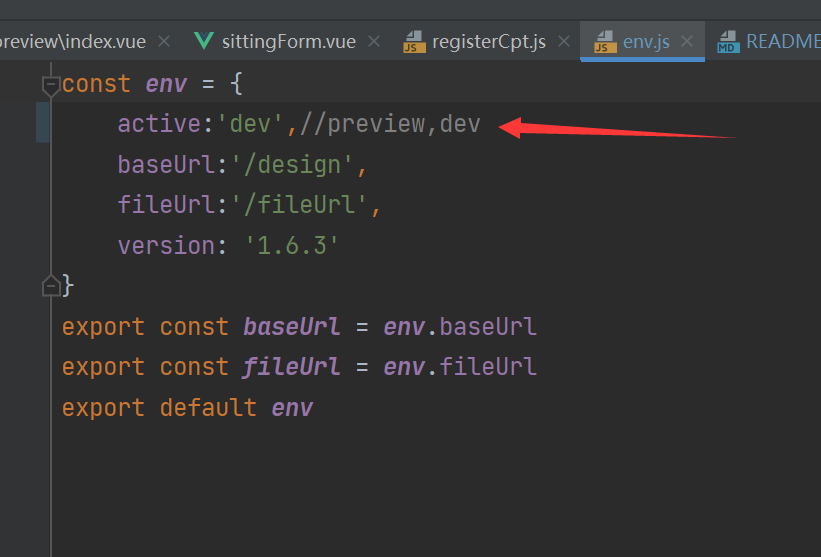

# cola-designer-vue
gitee：<a href="https://gitee.com/colaiven/cola-designer" target="_blank">cola-designer-vue</a>

github：[~~cola-designer-vue(随缘更新)~~](https://github.com/colaiven/cola-designer )

预览地址：<a href="http://colaiven.gitee.io/cola-designer/#/design" target="_blank">colaiven.gitee.io/cola-designer/#/design</a>
#### Project setup
```
yarn install
```
#### Compiles and hot-reloads for development
```
yarn serve
```
#### Compiles and minifies for production
```
yarn build
```
### 后端程序
后端程序：https://gitee.com/colaiven/cola-designer-java

前期为了方便演示以将后端接口分离，默认使用缓存方式，链接后端需要将env.js中的active修改成dev

后端架构：Springboot + SpringSecurity + mybatis-plus + mysql + redis

### 自定义组件
#### T：自定义组件注册方式
1. 在components下创建模块文件夹，建议按照ui模板分模块，如：element、echarts、ant-design...。
2. 在创建的模块文件夹下面创建vue组件，组件属性参数见下表：
   
   | 属性名      | 说明          | 类型    |是否必填  | 默认值|
   |  ----      |  ----        | ----   | ----   | ----  |
   | name       | 组件唯一标识   | String | 是      | 无 |
   | title      | 组件名        | String  | 是    | 未命名组件 |
   | icon       | 组件图标      | String  | 是     | el-icon-question |
   | initWidth  | 组件宽度(px)   | Number  | 否     | 300 |
   | initHeight | 组件高度(px)   | Number  | 否     | 200 |
   | group      | 组件分组标识   | String  | 否     | default |
   
    props（以下属性可直接在组建中使用，值与页面同步）：
   
   | 属性名      | 说明          | 类型    |
   |  ----      |  ----        | ----   |
   | option     | 自定义组件的自定义属性| Object |
   | height     | 组件高度| Number |
   | width      | 组件宽度| Number |
   
    示例：

```html
<template>
  <div>
    文本：{{option.text}}
    宽：{{option.width}}
    高：{{option.height}}
  </div>
</template>

<script>
export default {
    name: "cpt-text",
    title: '文字框',
    icon: 'el-icon-chat-line-square',
    initWidth: 300,
    initHeight: 50,
    group:'element',
    props: {
        option: Object,
        width:{type:Number,default:300},
        height:{type:Number,default:200},
    },
}
</script>
```

3. 在components/registerCpt.js中注册组件


   
4. 创建组件的自定义属性表单，命名方式为组件名-option
   
   示例：
```html
<template>
  <div>
    <el-form label-width="80px" size="mini">
      <el-form-item label="文本">
        <el-input v-model="option.text"></el-input>
      </el-form-item>
    </el-form>
  </div>
</template>

<script>
export default {
  name: "cpt-text-option",
  props: {
    option: Object
  },
}
</script>
```

5. 在components/registerOption.js中注册组件的自定义属性表单

   
6. 在components/options.js中对应组声明组件的自定义属性表单字段，这些字段将会与属性表单绑定


至此完成对自定义组件的注册，可在组件栏使用自己的组件

#### T：自定义组件命名方式
 建议使用：个人/公司名称简称-分组名-组件名

 组件自定义属性表单命名为：组件名-option
#### Q：提示组件未注册
#### Q：提示组件属性未注册

### 待优化项
· 宽高100%组件拉伸滚动条常驻现象

· 添加更多的组件

· 示例模板（支持导入导出）

